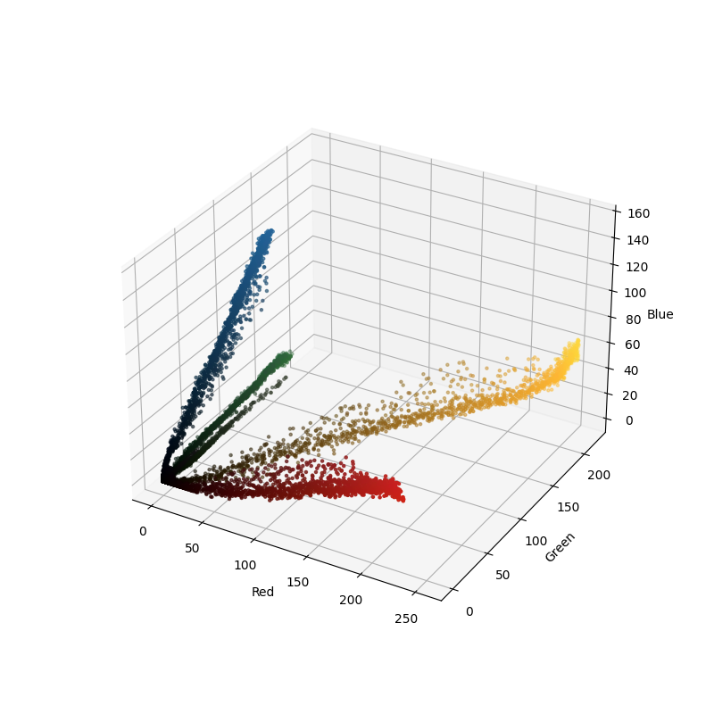
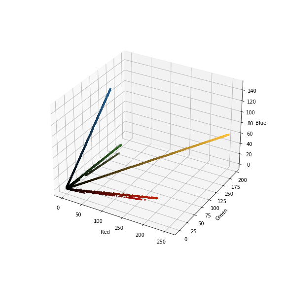
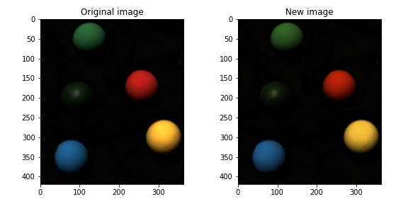

# RKquantization

This is a POC of my new color-quantization technic - that could be used to reduce the number of colors in an image, and represent each pixel with a pair of 2-bit vector choosing, and 4-bit R value on the vector.

this method works by finding the "direction" of color for each object in the image.

`I will demonstrate it by using this image`

## How it works
* recognize the different "color clusters" in the image, and see that they are infact linear lines - defined by the lightning and shadows of the object of a solid color.

* use a special version of hough transform to find the "direction" of the color cluster.
  - this was implemented by creating a hough space of the lines in their polar representation, assuming they all are going through the origin.
  - so, that gives us a 2d space of XY plane theta, and XZ plane theta.
* next, we need to decide on cluster centers in the hough space, so we can quantize the image.
  - this was done by using DBSCAN clustering on the hough space we want to quantize to.
  - the result of the clustering is the centers of the clusters in the hough space, and the line polar equations that represent the color clusters.

* now, we can quantize the image by transforming each point to each closest representation on one of the lines (a.k.a the vectors)
* 
* examine the results:

# Stuff that still need to be done:
1. [ ] decide on a better clustering algorithm, and implement a non maxima suppression algorithm to find local maxima in the hough space.
2. [ ] implement a vectorized version of the projection of the points to the lines, it's not efficient to do it in a for loop like the current naive implementation.
3. [ ] implement a file format to save the quantized image, and the color clusters that will compress the image. 
